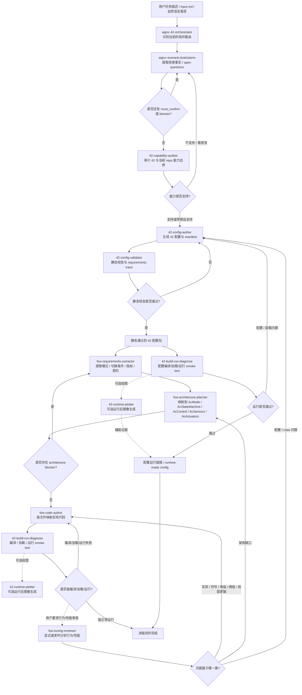

# AIGNC 42 Orchestrator Workflow Diagram

This document captures the end-to-end workflow currently organized by `aignc-42-orchestrator`.

## Full Workflow

## Reading Guide

- Configuration closure ends at `42-config-validator`.
- `42-build-run-diagnose` after configuration validation is an optional configuration build/load/run smoke-test branch.
- `42-runtime-plotter` is optional evidence generation once runtime `InOut/` telemetry exists.
- The FSW implementation branch uses `42-build-run-diagnose` only to confirm compile/load/run readiness. Behavior or performance review is a separate user-requested branch, not part of smoke-test pass/fail.
- `aignc-42-orchestrator` is only the router and stage gatekeeper. It does not replace the leaf skills.

## Workflow Logic

### 1. Scenario intake and clarification

The workflow starts from a user mission description, `input.md`, or other natural-language task statement.

`aignc-42-orchestrator` first determines the current stage and routes the work to `aignc-scenario-brainstorm`.

`aignc-scenario-brainstorm` is responsible for:

- extracting structured scenario facts
- separating confirmed facts from assumptions
- identifying `must_confirm` questions
- identifying blockers that prevent downstream work

If blocking clarification questions still exist, the workflow stays in the clarification loop and does not advance.

### 2. Capability audit

Once the scenario facts are sufficiently clear, the workflow moves to `42-capability-auditor`.

This stage checks whether the requested mission can be supported by:

- native 42 simulator capability
- fixed `CFS_FSW`
- current repo-side extensions such as sidecar optical-link support

This stage must explicitly separate:

- supported behavior
- supported-with-assumptions behavior
- unsupported behavior
- behavior that requires extension work

If the scenario is not supportable as currently stated, the workflow returns to clarification or assumption adjustment rather than moving into configuration generation blindly.

### 3. 42 configuration generation and static closure

If capability audit concludes that the request is supportable, the workflow moves into:

- `42-config-author`
- then `42-config-validator`

`42-config-author` generates the workspace configuration artifacts and the manifest describing what was generated and what assumptions were used.

`42-config-validator` then performs static closure, including:

- file existence checks
- cross-file reference checks
- parser-shape and key field checks
- requirements trace checks against the scenario and capability outputs

This stage is the formal end of the requirements/configuration branch.

If static validation fails, the workflow returns to `42-config-author`.

### 4. Optional build/load/run smoke test for the configuration branch

After static closure, the workflow may optionally enter `42-build-run-diagnose` to prove only that the generated case can be compiled, loaded, parsed, and run by 42.

This stage is not part of the requirements-analysis closure. Its role is narrower:

- confirm the case can build and execute
- detect missing files, parser/load failures, and immediate runtime aborts
- verify basic output presence

If the case fails to load because of configuration issues, the workflow returns to `42-config-author`.

If the workspace package builds, loads, runs to normal completion, and emits basic outputs, the configuration branch is considered runtime-ready. This says nothing about GNC behavior or performance.

### 4a. Optional post-run plotting

When runtime `InOut/` telemetry exists, the workflow can pass through `42-runtime-plotter`.

This optional stage is reusable and scenario-agnostic. It can generate a standard visualization bundle, including:

- three-axis spacecraft body angular velocity
- orbit-frame attitude error by axis
- reaction wheel speed

These plots are optional auxiliary evidence and do not define `42-build-run-diagnose` pass/fail semantics.

### 5. FSW requirements extraction

If the task includes fixed `CFS_FSW` implementation work, the workflow branches from the validated configuration package into `fsw-requirements-extractor`.

This stage converts mission intent into structured FSW requirements such as:

- mode definitions
- transition conditions
- sensor and actuator contracts
- control-law constraints
- performance targets

Its outputs are the structured requirement package used by downstream FSW planning.

### 6. FSW architecture planning

The next stage is `fsw-architecture-planner`.

This stage does not write code. It maps the extracted FSW requirements onto concrete code ownership, including:

- `AcMode.c`
- `AcStateMachine.c`
- `AcControl.c`
- `AcSensors.c`
- `AcActuators.c`

It also separates:

- fixed `CFS_FSW` work
- sidecar optical-link work
- native 42 truth-model extension work

If architecture blockers remain unresolved, the workflow does not move into implementation. It returns for clarification or upstream revision.

### 7. FSW code implementation

Once an architecture package exists and blockers are resolved, the workflow advances to `fsw-code-author`.

This stage is responsible for:

- implementing only the mapped code changes
- keeping edits within planned ownership boundaries
- compiling the codebase
- emitting implementation artifacts such as change summaries

This stage is the first point where source code is expected to change.

### 8. Build/load/run smoke test of implemented FSW

After implementation, the workflow can return to `42-build-run-diagnose`, but only as a compile/load/run smoke test.

This stage:

- builds and runs the case
- captures load/parser failures, immediate runtime aborts, and basic output presence
- returns pass when the case compiles, loads, runs to normal completion, and emits basic outputs

It does not distinguish good behavior from bad behavior and does not judge mission performance. If the code does not compile or the case cannot load/run, the workflow returns directly to `fsw-code-author` or `42-config-author` according to the failure source.

### 9. Optional FSW behavior and tuning review

If the user explicitly asks to analyze behavior or performance after a successful smoke test, the workflow may enter `fsw-tuning-reviewer`.

This stage is not only about gain tuning. It reviews runtime evidence from several angles, including:

- whether the intended sensor, actuator, and switching strategy is actually what the workspace is running
- whether coordinate frames, guidance frames, and attitude-error calculations are implemented correctly
- whether `CFS_FSW` assumptions match the 42 simulator-side definitions
- whether sensors are valid, occluded, excluded, or sampled too slowly
- whether actuators are saturated or rate-limited
- whether the state machine, hold times, timeouts, or run duration explain the issue

The normal output of this stage is a bounded review package that feeds the next `fsw-code-author` iteration.

Only when the evidence shows a true architecture gap should the workflow return to `fsw-architecture-planner`.

### 10. Normal termination conditions

The workflow normally terminates in one of three ways:

1. configuration branch closure:
   - static validation passes
   - build/load/run smoke test is optional

2. runtime-readiness completion:
   - the generated workspace package builds, loads, runs to normal completion, and emits basic outputs

3. FSW implementation closure:
   - implementation compiles
   - the case loads and runs to normal completion
   - any behavior/performance review is explicitly requested separately

In all cases, `aignc-42-orchestrator` remains a routing and gatekeeping layer rather than the worker that performs leaf-stage generation or implementation.
